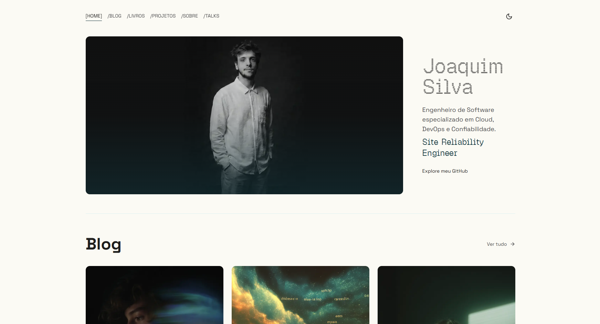
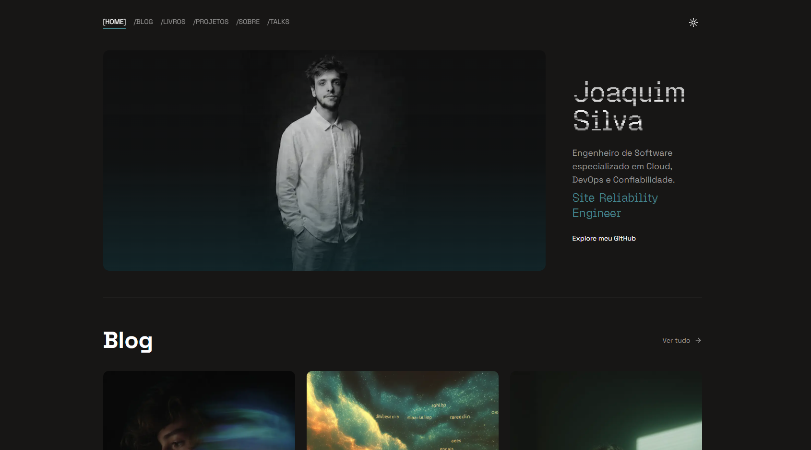

<div align="center">
  
  
  # joaquimsnjr.tech
  
  **Meu cantinho na internet** — Portfolio pessoal, blog técnico e sistema de apresentações.

  [](https://joaquimsnjr.tech)
  [](https://nextjs.org/)
  [](https://www.typescriptlang.org/)
  [](https://tailwindcss.com/)

  [🌐 Acessar Site](https://joaquimsnjr.tech) • [📝 Blog](https://joaquimsnjr.tech/blog) • [🎤 Talks](https://joaquimsnjr.tech/talks)
</div>
<p align="center">
  <a href="https://github.com/joaquimsnjunior/joaquimsnjr.tech/issues">Reportar Bug</a>
</p>

---

<p align="center">
  <h1>Preview Light Mode</h1>
  

  <h1>Preview Dark Mode</h1>
  
</p>

## ✨ Features

- **Blog com MDX** — Posts técnicos com syntax highlighting (Shiki), suporte a código Go, TypeScript e mais
- **Sistema de Apresentações** — Deck de slides integrado com navegação por teclado, swipe mobile e modo apresentador
- **SEO Completo** - Meta tags, Open Graph, Twitter Cards e sitemap dinâmico
- **Performance** — Imagens otimizadas via Cloudinary, lazy loading e prefetch inteligente
- **Design Terminal-Style** - Interface única inspirada em terminais Unix
- **Dark/Light Mode** - Tema escuro e claro
- **Navegação por Atalhos** — `[h]` home, `[b]` blog, `[s]` sobre, `[t]` talks
- **Animações Suaves** - Efeitos de scramble text e fade-in

---

## 🛠️ Stack Tecnológica

| Categoria | Tecnologia |
|-----------|------------|
| **Framework** | [Next.js 15](https://nextjs.org/) (App Router) |
| **Linguagem** | [TypeScript](https://www.typescriptlang.org/) |
| **Estilização** | [TailwindCSS](https://tailwindcss.com/) |
| **Conteúdo** | [MDX](https://mdxjs.com/) + [next-mdx-remote](https://github.com/hashicorp/next-mdx-remote) |
| **Syntax Highlight** | [Shiki](https://shiki.style/) |
| **Imagens** | [Cloudinary](https://cloudinary.com/) |
| **Cache** | [Upstash Redis](https://upstash.com/) (view counter) |
| **Deploy** | [Vercel](https://vercel.com/) |
| **Fonte** | [Geist Mono](https://vercel.com/font) |
| **Outros** | [Framer Motion](https://motion.dev/), [Lucide Icons](https://lucide.dev/) |

---

## 📁 Estrutura do Projeto

```
joaquimsnjr.tech/
├── 📂 posts/                     # Artigos do blog em MDX
│
├── 📂 public/                    # Assets estáticos (imagens, favicon, etc.)
│
└── 📂 src/
    ├── 📂 app/                   # App Router (Next.js 15)
    │   ├── 📂 blog/              # Sistema de blog
    │   ├── 📂 presentations/     # Rotas das apresentações
    │   ├── 📂 og/                # Geração de Open Graph images
    │   ├── 📂 sobre/             # Página sobre
    │   ├── 📂 talks/             # Página de talks
    │   └── ...
    │
    ├── 📂 components/            # Componentes React reutilizáveis
    │   ├── 📂 deck/              # Sistema de apresentação de slides
    │   └── ...
    │
    ├── 📂 lib/                   # Utilitários e helpers
    │
    └── 📂 presentations/         # Arquivos de apresentações (TSX)
```


---

## Rodando Localmente

```bash
# Clone o repositório
git clone https://github.com/joaquimsnjunior/joaquimsnjr.tech.git
cd joaquimsnjr.tech

# Instale as dependências
npm install

# Rode o servidor de desenvolvimento
npm run dev
```
> Acesse **http://localhost:3000**

---

## 📄 Licença
Este projeto é open source e está disponível sob a MIT License.

---

<div align="center"> <sub>Feito com ☕ por <a href="https://joaquimsnjr.tech">Joaquim Silva</a></sub> </div>